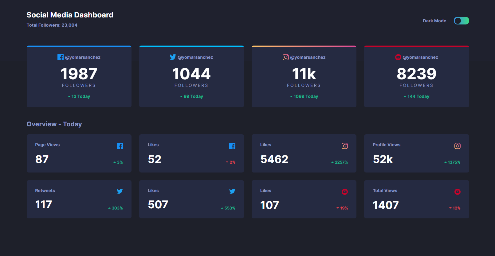

  
  

## Social media dashboard with theme switcher

Proyecto desarrollado gracias al **#LiveLiveCoding #1** en el canal de [**@LeonidasEsteban**](https://www.youtube.com/leonidasesteban). 
Demo https://yomarsanchez.github.io/social-media-dashboard

- **Video Youtube :** [Responsive Design Mobile first & Dark Mode | Frontend Mentor challenge #1](https://youtu.be/ScSHSI7TzRw).

### Resultado esperado

### License

The project is open-sourced software licensed under the [MIT license](https://opensource.org/licenses/MIT).
